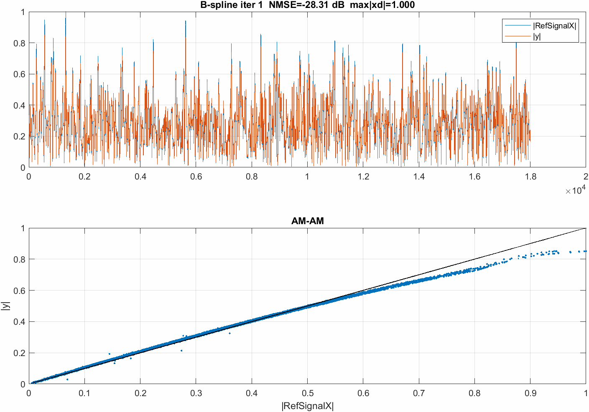
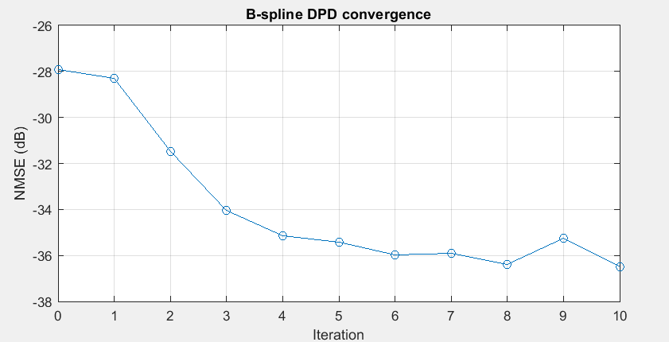
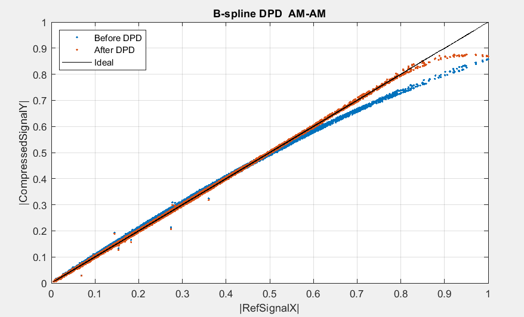
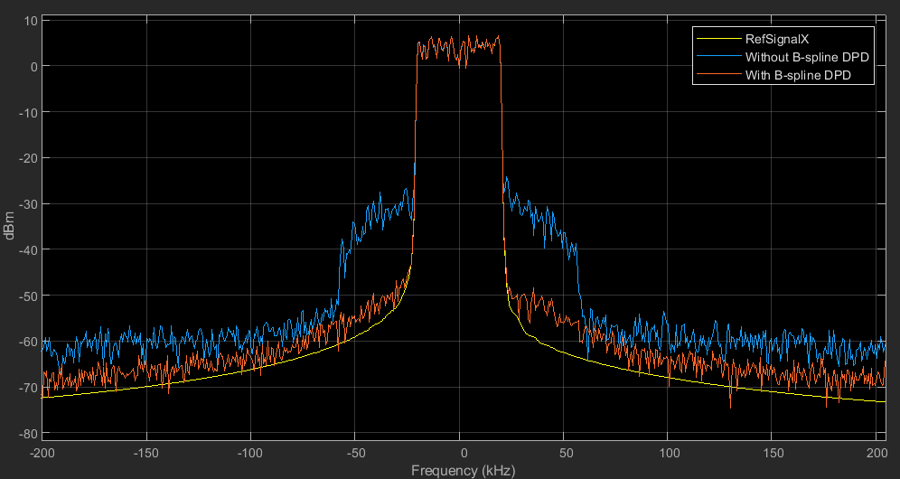

# B-spline DPD on ADALM-Pluto SDR

**B-spline Digital Predistortion (DPD)** with a real **ADALM-Pluto** SDR in a
hardware-in-loop TX→RX loopback. The predistorter is a complex gain `G(|x|)`
on a cubic B-spline basis, fit by weighted least squares and refined with an
additive ILC-style update directly from measurements.

Companion project (model-free, sample-by-sample variant):
[ILC-DPD-PlutoSDR](https://github.com/zonelincosmos/ILC-DPD-PlutoSDR) — same
TX/RX/Pluto setup, waveform, and sync; only the predistorter differs.

## Results

Per-iteration learning (animation):



Convergence (NMSE vs iteration):



AM-AM, before vs after B-spline DPD:



Output spectrum:



## How it works

The DPD is a complex gain `G(r)`, `r = |x|`, expanded on a degree-3 B-spline
basis with `nSeg` uniform segments. Start from an identity seed
(`G(r) ≈ 1`, fit in the same basis the update uses, so iteration 1 transmits
`xd ≈ x`). Each iteration:

1. **Predistort** — evaluate the capped gain LUT and apply
   `xd = G(|x|) .* x`. `capLUT` enforces a gain ceiling (`G_max`), a drive
   cap (`r_drive`, keeps `|xd|` within Pluto DAC full-scale), and smooth
   extrapolation of the data-sparse high-amplitude region.
2. **Capture & average** — transmit `xd` on the Pluto, receive the loopback,
   and run `captureAndSync`: integer alignment via cross-correlation,
   fractional alignment via a cubic-Lagrange Farrow resampler, then DC
   removal and RMS + phase normalization to the reference. Repeat `N_avg`
   times and average (I/Q averaging) to suppress measurement noise.
3. **Update** — additive weighted-least-squares (ILC-style) coefficient
   step:

   ```
   c_{k+1} = c_k + mu * ( AtWA \ AtWb )
   ```

   `AtWA` / `AtWb` are accumulated sample-by-sample (de Boor recursion, 4
   nonzero bases per sample) with amplitude weighting; the target ceiling
   `Psat` is refined from each capture.

The error to the ideal linear response (NMSE) is logged each iteration.

## Requirements

- MATLAB with **Communications Toolbox** (`sdrrx` / `sdrtx` for Pluto) and
  **DSP System Toolbox** (`dsp.SpectrumAnalyzer`).
- An **ADALM-Pluto** SDR with a **TX↔RX loopback** (coax cable + suitable
  attenuator; do not exceed the RX input rating).
- `RefSignal.mat` — the reference waveform (included; self-generated).

## Run

```matlab
>> Bspline_DPD_PlutoSDR
```

Key parameters at the top of `Bspline_DPD_PlutoSDR.m`:

| Param | Meaning | Default |
|------|---------|---------|
| `CenterFrequency` | RF center frequency (MHz) | 2000 |
| `BasebandSampleRate` | Baseband sample rate (MHz) | 1 |
| `TxGain` / `RxGain` | Pluto TX / RX gain (dB) | -3 / 0 |
| `deg` / `nSeg` | B-spline degree / segments | 3 / 16 |
| `G_max` | DPD gain ceiling | 1.6 |
| `r_drive` | drive cap (keeps \|xd\| in DAC range) | 1.0 |
| `mu` | additive-update learning rate | 0.5 |
| `N_avg` | I/Q averaged captures per iteration | 16 |
| `n_iter` | DPD iterations | 10 |
| `N_LUT` | LUT entries (gain table size) | 16 |

## Repository contents

| File | Description |
|------|-------------|
| `Bspline_DPD_PlutoSDR.m` | Main script (B-spline DPD loop + `captureAndSync` + Farrow resampler + WLS) |
| `Bspline_DPD_PlutoSDR_2.m` | Variant: only the `G_max` gain cap is active (drive cap + extrapolation disabled), endpoint LUT entries pasted to a stable interior neighbor, per-iteration LUT(dB) overlay plotted |
| `Bspline_DPD_PlutoSDR_2_memory.m` | Memory extension of `_2`: predistorter is a sum of 5 memory taps (3 self + 2 cross), each with its own complex B-spline LUT; one joint WLS solve per ILC iteration |
| `RefSignal.mat` | Reference waveform |
| `images/` | Result figures and the convergence animation |
| `LICENSE` | MIT license |

## License

MIT — see [LICENSE](LICENSE).
